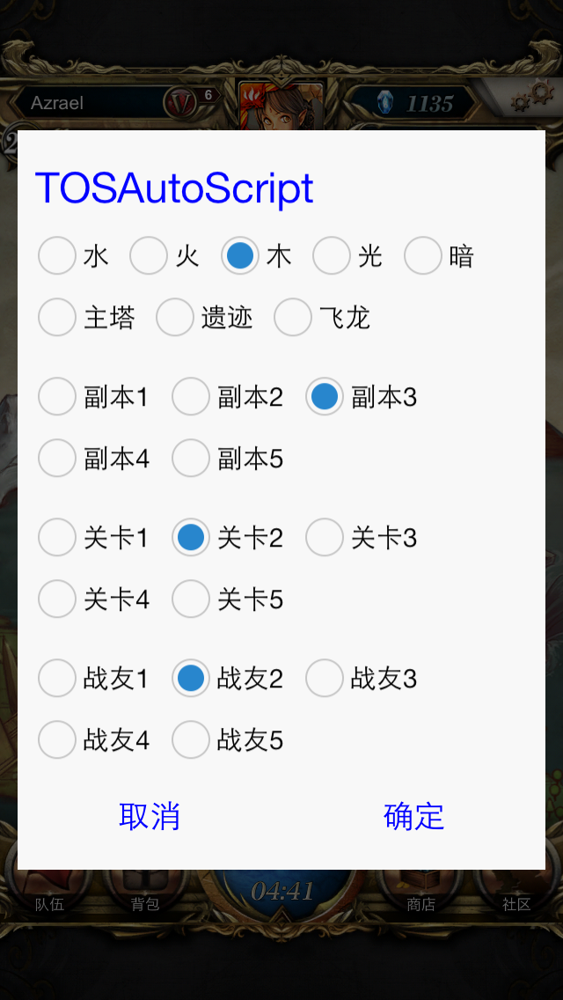

# TOSAutoScript
神魔之塔的半智能自动挂机的lua脚本, 需要配合触动精灵和自动转珠插件使用

半智能: 自动点击战斗结算/友情点结算, 自动购买体力，`但不会自动卖卡`

##使用说明
其中的坐标都是在 iPhone5 上面的, 在其他设备需要自己选好坐标

选副本和战友的地方也是在代码里写好的, 自己用的话改改坐标就好了

目前做了一个选图UI, 可以选择地图, 关卡, 以及战友, 顺序是从上到下数

然后回到主地图的界面, 执行脚本后就会自动选图选战友, 进度战斗之后, `开启自动转珠工具`, 然后就会全自动刷刷刷了
